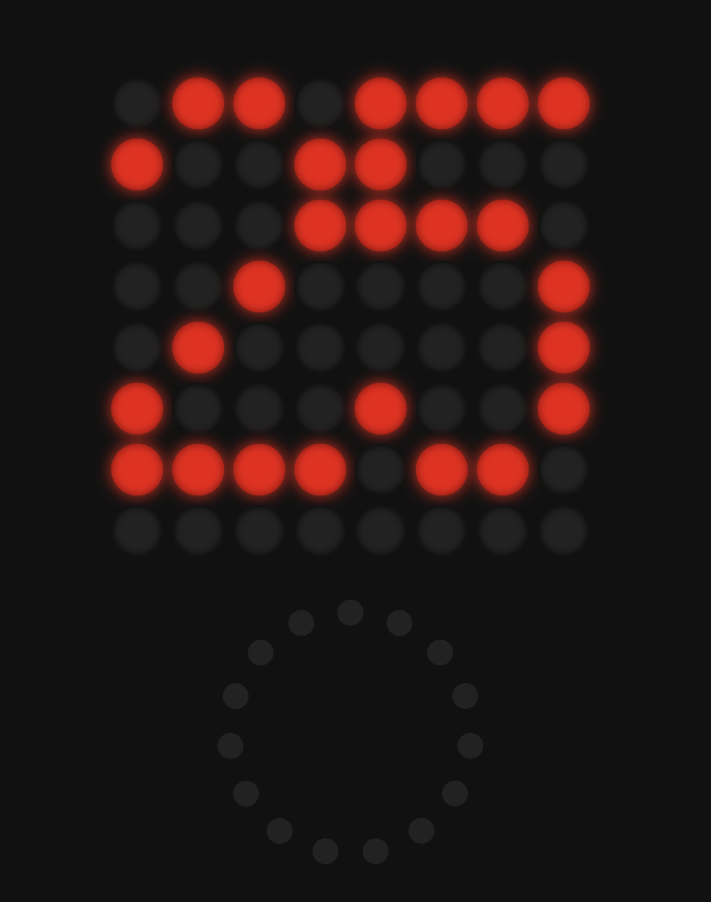

# Pomodoro Spiral Timer

A responsive, mobile-friendly Pomodoro timer implemented as a web page that simulates an 8×8 LED matrix and a rotary knob control. It keeps the screen awake using the Wake Lock API and provides haptic feedback on supported devices.

## Features

- **8×8 LED Matrix Simulation**: Renders a dynamic spiral fill and displays numbers using a pixel font.
- **Rotary Knob Control**: Click-and-drag (or touch-and-drag) to scroll through menu options (25, 5, 15 minutes), click to select, double-tap to skip or cancel a running timer.
- **Haptic Feedback**: Short vibration on scroll clicks and longer vibration on press clicks, even when the device is silenced.
- **Wake Lock**: Uses the Screen Wake Lock API to prevent the screen from turning off during use.
- **Responsive Design**: Scales to fit any screen size (desktop, mobile, tablet) with CSS variables and `clamp()`.
- **Spiral Timer Animation**: Fills LEDs in a spiral, with a slow blink effect for each step, and displays the elapsed minutes after completion.

## Getting Started

### Prerequisites

A modern web browser with support for:

- Screen Wake Lock API
- Vibration API

Most up-to-date versions of Chrome, Edge, Firefox on Android and other mobile devices support these features.

### Installation

1. Download `pomodoro.html`.

2. Open `pomodoro.html` in your preferred browser.

No build tools or dependencies required.

## Usage

1. **Intro Screen**: Shows a tomato icon and "pomodoro" text animation.
2. **Menu**: Use the rotary knob to select 25, 5, or 15 minutes. Selected value is displayed as a number.
3. **Start Timer**: Click the knob to begin the spiral timer animation.
4. **Cancel or Skip**: Double-tap the knob to skip the intro or return to the menu at any time.
5. **Completion**: After finishing, the timer displays the set minutes and then returns to the menu.

## File Structure

├── pomodoro.html       # Main application file  
├── README.md        # Project documentation  

## Compatibility & Limitations

- **Wake Lock**: The screen wake lock may not be supported in all browsers. Without support, the screen may still dim.
- **Vibration**: Haptic feedback requires a device with vibration hardware and browser support.
- **Performance**: Heavy animations may use more battery on mobile devices.

---

*Created with ❤️ by miguelcoxcaballero*
